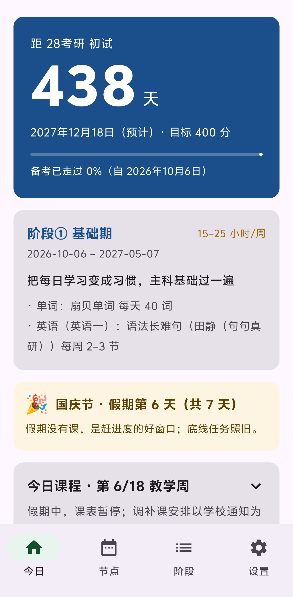
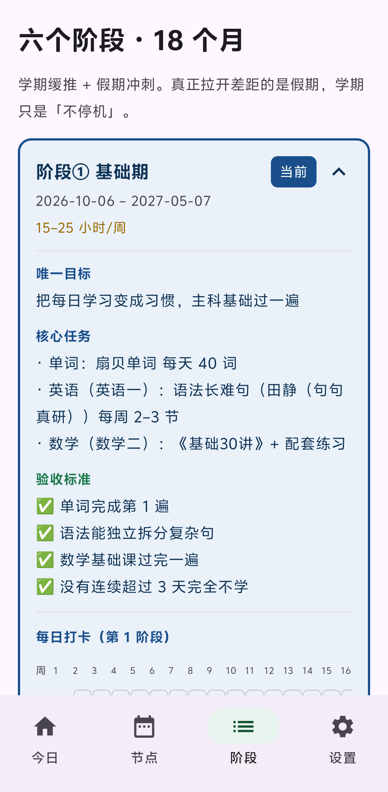
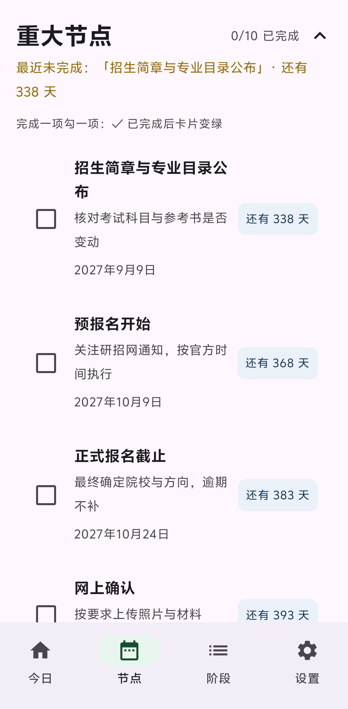
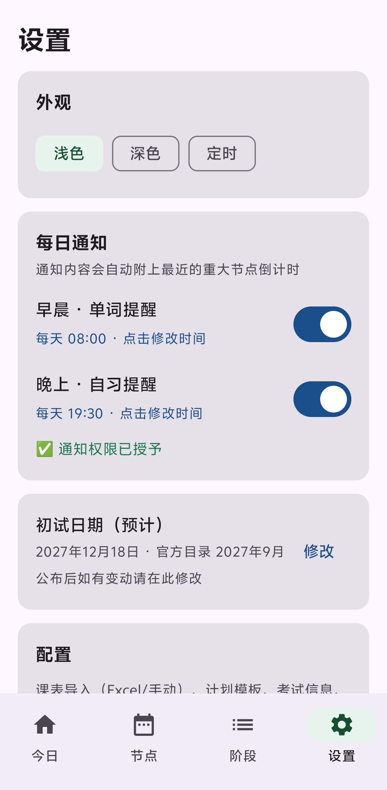
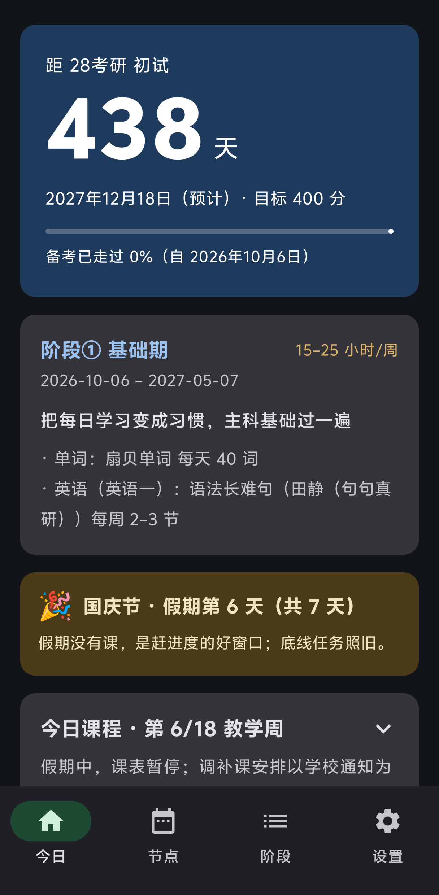
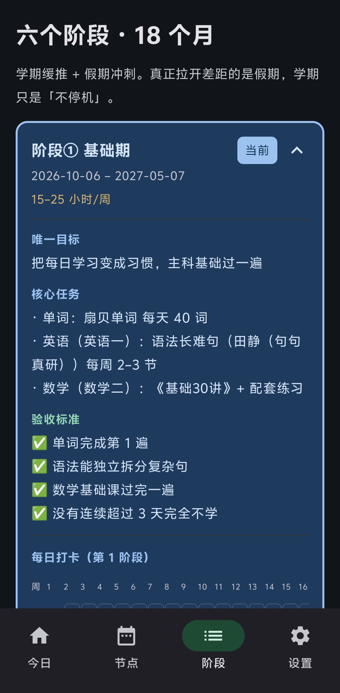
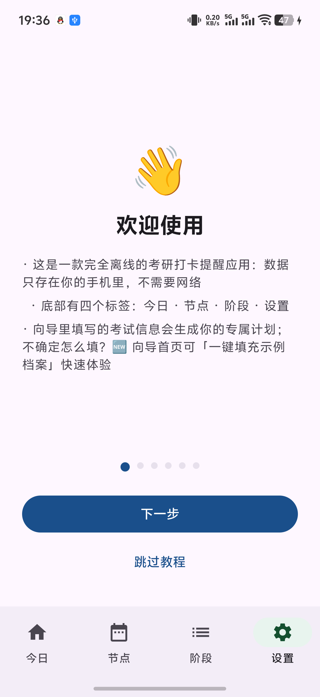
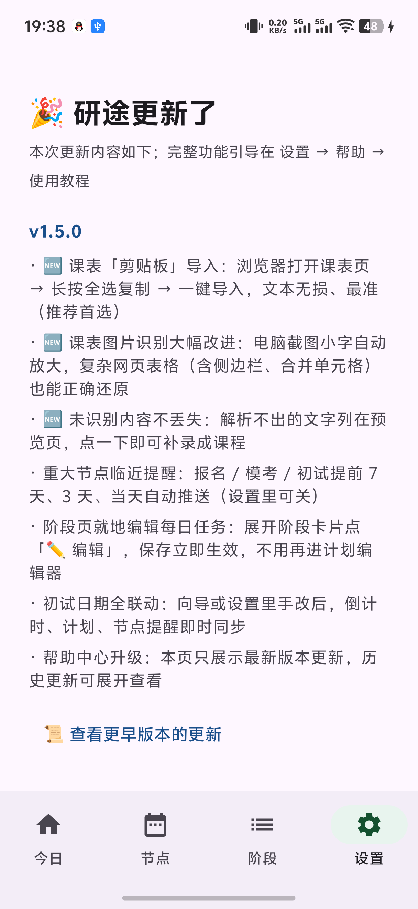
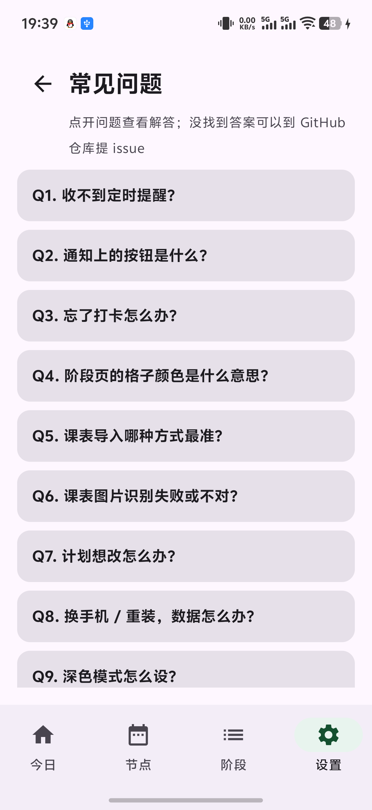
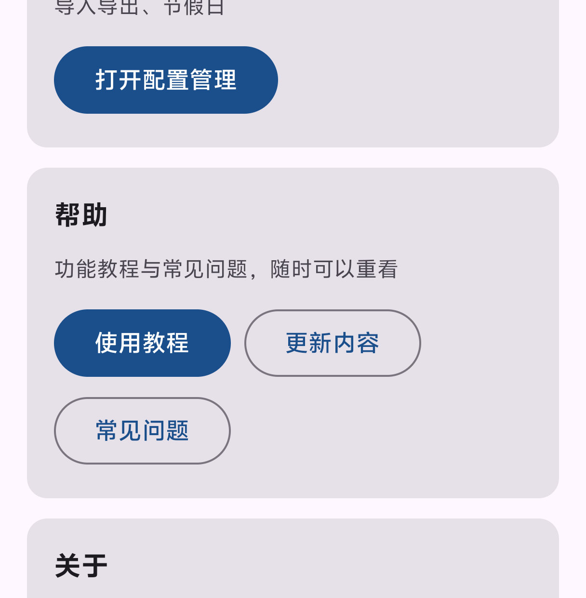

# 日拱一卒 · 备考打卡提醒

> 日拱一卒，功不唐捐。

一个把「备考计划」变成**每天可执行任务**的 Android 应用：倒计时、阶段打卡、每日达标奖励、定时提醒、课表导入，全部**离线运行**、无账号、无网络权限。

最初是为 28 考研（华南理工·机械）备考自制，现已重构为**配置驱动**的通用版本：换考试、换学校、换课表、换计划，只在应用内配置，**不改任何代码**。中后期才开始用的同学也不必从零重来——计划生成支持「复习起点」，直接从强化期 / 真题期 / 冲刺期切入。

## ✨ 功能特性

**计划与进度**
- ⏳ 考试倒计时：自定义名称、日期、目标分；距初试 ≤ 100 天自动转**红色冲刺样式**
- 🗓 阶段计划：按考试日期比例倒推（基础 / 强化 / 真题 / 冲刺），早开始晚开始节奏都不失衡；**复习起点**可选，跳过已完成阶段
- 🎯 重大节点自动生成（简章 → 报名 → 确认 → 初试）；复试等院校自定时间的节点显示为「时间待定」范围提醒，**初试是唯一硬时间线**
- 📊 阶段打卡格采用**日历式**排布：行 = 教学周，列 = 周一到周日，格内是日期、今天描边

**打卡与激励**
- ✅ 每日打卡「达标制」：**底线任务全完成 + 其余过半 = 达标**（深绿 = 全部完成，浅绿 = 达标，黄 = 部分）
- 🎁 双层奖励：日达标记小奖励，周投入达标记大奖励（奖励池可自定义，取消打卡同步撤回）
- 🔥 底线连勤统计：连续 / 累计天数按**底线任务全完成**计算，不绑定具体科目
- 🔁 最近两天补卡；💾 一键数据备份，换机无损迁移

**提醒（离线可靠）**
- 🌅 每天早晨 / 晚上定时提醒，通知栏可直接「**完成底线任务**」或「**稍后提醒**」；关机错过自动补发
- 📍 **重大节点临近提醒**：报名、模考、初试等硬节点提前 **7 天 / 3 天 / 当天** 上午 9 点推送（可关闭）
- ⚠️ 21:00 底线警戒 + 周日晚报（本周投入估算、奖励结算）

**课表（三种导入方式）**
- 📋 **剪贴板导入（推荐）**：浏览器打开课表页 → 长按全选复制 → 一键导入。复制的就是表格原始文本，**课名/周次/教室一字不差，且不挑学校**
- 📚 **Excel 解析**：教务系统导出的 .xls / .xlsx（含**共享公式**填充的表）；解析结果预览页逐条校正
- 📷 **图片识别**：学校原始课表**截图**离线识别——中文模型内置在 APK，不联网、不上传；大屏截图小字自动放大，复杂网页表格（侧边栏、合并单元格）也能还原
- 🛟 **不丢数据**：任何方式解析不出的内容会列在预览页，点一下即可补录成课程
- ✍️ 手动添加；或导入同学分享的配置包
- 📅 手机日历只读展示当天日程（可选授权）；🧭 内置**信息渠道清单**（研招网 / 院校研招网 / 学院官网 / 上岸学长…），注明看什么、何时看

**体验**
- 🧭 首次启动 4 步向导 + **分页使用教程**（可随时重看）+ 常见问题 Q&A
- 🧪 向导支持**一键填充示例档案**（28 从零 / 28 已过基础 / 27 真题期 / 冲刺起步），快速体验
- 🌙 浅色 / 深色 / 定时三种外观（支持跨夜时段）

## 🚀 快速开始

1. 从 **[国内下载](#安装)**（蓝奏云直连）或 [GitHub Releases](../../releases/latest) 下载 APK 安装（Android 8.0+）
2. 首次打开进入向导：填考试信息与目标院校（不确定的项可填「待定」），选科目 / 老师 / 复习起点
3. 想先看看功能？向导首页点「📋 一键填充示例档案」即可用预设配置体验全部功能

换考试 / 换学校 / 换计划：设置 → 配置管理，全部可视化操作。

## 📸 截图

**浅色模式**

| 今日 | 阶段打卡 |
|---|---|
|  |  |

| 重大节点 | 设置（外观切换） |
|---|---|
|  |  |

**深色模式**（设置 → 外观：浅色 / 深色 / 定时）

| 今日 | 阶段打卡 |
|---|---|
|  |  |

**帮助与引导**（新用户看完整教程；升级用户只看「更新内容」速览）

| 使用教程 | 更新内容 |
|---|---|
|  |  |

| 常见问题 | 设置 · 帮助 |
|---|---|
|  |  |

## 📦 安装

三个下载入口，任选其一（安装包相同）：

**🇨🇳 国内直连（最快）** —— [蓝奏云](https://wwbai.lanzouv.com/imyCz4b5ql8b)

| 安装包 | 链接 | 提取码 |
|---|---|---|
| `yantu-v1.5.0-arm64.apk`（主流手机） | [蓝奏云下载](https://wwbai.lanzouv.com/imyCz4b5ql8b) | `9x5c` |
| `yantu-v1.5.0-v7a.apk`（32 位老设备） | [蓝奏云下载](https://wwbai.lanzouv.com/i8PHd4b5qlng) | `8rag` |

打开链接 → 输入提取码 → 点「普通下载」，无需登录、无需客户端。

> ⏫ 蓝奏云将随下次上传更新为 v1.5.1（更名版）；当前表格为 v1.5.0 安装包（功能相同，仅应用名不同），最新版请优先用下方 GitHub Releases。

**🌍 GitHub Releases** —— [releases/latest](../../releases/latest)

无需任何提取码，点击即下；同时可以浏览**全部源码、历史版本与每版更新日志**。直连慢时，可在 release 页面里复制 APK 链接，在前面加 `https://ghproxy.net/` 加速，或使用上方蓝奏云入口。

> 与旧版本签名一致，覆盖安装**保留全部数据**。图片识别的中文模型已内置在 APK 内（约 22MB）。

## 🕘 版本更新日志

### v1.5.1 · 更名
- 应用更名为「**日拱一卒**」（日拱一卒，功不唐捐）——原名称与第三方考研机构商标重名，为避免混淆而更换
- 更名不影响任何数据：打卡记录、计划、课表、奖励全部保留（应用内自动迁移旧名称）
- 桌面图标名称同步更新，功能与使用方式完全不变

### v1.5.0 · 课表导入与提醒全面升级
- 📋 **课表「剪贴板导入」**：浏览器打开课表页全选复制即可导入——文本无损、不挑学校，成为首选导入方式
- 📷 **图片识别大幅改进**：电脑截图小字自动放大识别；重写版面重建算法（表头锚定列 + 行级节次锚 + 节次列自举），复杂网页表格（含侧边栏、跨行合并单元格）也能正确还原；已在真实教务截图样本上逐条验证
- 🛟 **未识别内容不再丢失**：解析不出的文字收集到预览页，点一下补录成课程，任何课表都不会“白导一场”
- 📍 **重大节点临近提醒**：报名 / 模考 / 初试等硬节点提前 7 天 / 3 天 / 当天上午 9 点推送（可关闭）
- ✏️ **阶段页就地编辑每日任务**：展开阶段卡片直接改标题 / 时长 / 底线，保存立即生效
- 🔗 **初试日期全联动**：向导或设置里手改后，倒计时、计划、节点提醒即时同步（修复双轨日期不同步）
- 🆕 **引导双轨制**：新用户看完整教程；升级用户只看「更新内容」速览（本页），历史更新可展开
- 🎨 导入按钮改为「Excel / 剪贴板 / 图片」三短词；帮助区按钮小屏自适应换行

### v1.4.0 · 规划与提醒升级
- 📍 重大节点临近提醒（首版）；🧭 信息渠道清单
- 📷 课表图片识别（离线中文 OCR）；低分屏截图适配；xlsx 共享公式
- 🛠 底线体系通用化：通知 / 快捷打卡 / 连续统计按实际底线任务工作，不再写死「背单词」
- 📮 反馈双通道（GitHub Issues + 邮箱）；APK 按 ABI 拆分瘦身（52MB → 22MB）
- 阶段页顶部策略提示跟随当前阶段；导入入口增加「学校原始课表」引导

### v1.2.0 · 后期考生友好
- 计划生成新增**复习起点**：从零 / 已过基础 / 已进真题 / 冲刺起步，起点前阶段自动跳过
- 向导首次使用必填关键信息（目标分除外）、重跑预填旧配置且不重复教程
- 初试日期快捷选择（27 / 28 考研），**届别自动推断**考试名称；备考起始日快捷键
- 科目改为四槽固定格式（政治 / 外语 / 数学 / 专业课）；重大节点默认折叠摘要；≤100 天倒计时转红
- 向导「一键填充示例档案」

### v1.1.0 · 新手引导与时间线修正
- 分页**使用教程**（首次自动弹出，设置可重看）+ 常见问题 Q&A
- 复试等院校自定时间节点改为「时间待定」范围提醒，不再显示硬倒计时
- 阶段打卡格改为日历式（行 = 教学周、列 = 周一至周日、今天描边）
- 向导前两步必填校验 + 动画气泡引导

### v1.0.1 · 外观与体验
- 外观切换改为浅色 / 深色 / 定时三档（定时支持跨夜时段）；系统返回键逐级返回子页面

### v1.0.0 · 首个公开版本
- 倒计时、比例阶段计划、达标制打卡、双层奖励、四路定时提醒（通知快捷操作、关机补发）、Excel 课表导入、日历日程、补卡、数据备份、向导 / 计划编辑器 / JSON 模板三种个性化方式

## ❓ 常见问题

**收不到定时提醒？** 允许本应用「后台运行 / 自启动」（vivo/OPPO 在「电池」，小米在「省电与电池」，华为在「应用启动管理」），并在最近任务里给卡片加锁。应用内 设置 → 帮助 → 常见问题 有完整排查清单。

**课表识别 / 解析不准确？** 请用学校原始课表的完整清晰截图（或教务系统导出的 Excel）；导入后会在预览页逐条确认，可改可删可补录。各校格式差异大，预览确认是兜底。

**数据存在哪？** 全部在本机，不上传任何服务器；换机用「导出数据备份 / 导入数据备份」。

## 📮 反馈

- [GitHub Issues](https://github.com/kennySzhucheng/yantu/issues) —— 提 bug、功能建议
- 邮件：kennySli@163.com（应用内 设置 → 关于 → ✉ 邮件反馈 可直达）

课表识别的准确率依赖真实样本：如果你的课表截图识别失败或错得离谱，欢迎把截图和机型发到上面渠道，帮助我改进解析。

## 🛠 开发者

```bash
# 构建 debug
./gradlew assembleDebug

# 发布构建（需先配置签名；下方 alias 名 yantu 为历史签名别名，改名不影响已发布版本，请保持）
# 1) 生成密钥库：
keytool -genkeypair -v -keystore release.keystore -alias yantu \
  -keyalg RSA -keysize 2048 -validity 10000
# 2) 在项目根目录创建 keystore.properties：
#    storeFile=release.keystore
#    storePassword=<你的密码>
#    keyAlias=yantu
#    keyPassword=<你的密码>
# 3) 构建（按 ABI 拆分）：
./gradlew assembleRelease
# 产物：app/build/outputs/apk/release/app-<abi>-release.apk
```

- 技术栈：Kotlin + Jetpack Compose (Material 3) + DataStore + WorkManager + ML Kit 中文文字识别（离线模型内置）；jxl 用于 .xls 解析
- 配置格式：`app/src/main/assets/config/*.json`（内置示例），用户配置层存于 DataStore 并**覆盖**内置
- 换学期课表：`python tools/gen_timetable.py "课表.xls" 2026-08-31 > app/src/main/assets/config/timetable.json`

## 🔒 隐私

- 不联网、无网络权限、无统计 / 追踪
- 课表图片识别在本机完成，图片不上传
- 日历为只读（可选授权，仅用于显示当天日程）
- 所有数据可随时导出与清除

## 许可

[MIT](LICENSE)

## 第三方依赖

- AndroidX / Jetpack Compose / WorkManager / DataStore（Apache-2.0）
- [ML Kit Text Recognition v2（中文）](https://developers.google.com/ml-kit/vision/text-recognition)（离线文字识别，Apache-2.0 下的 Google ML Kit 条款）
- [jxl — JExcelApi](http://jexcelapi.sourceforge.net/)（LGPL-2.1，用于解析教务系统的 .xls 课表导出）
